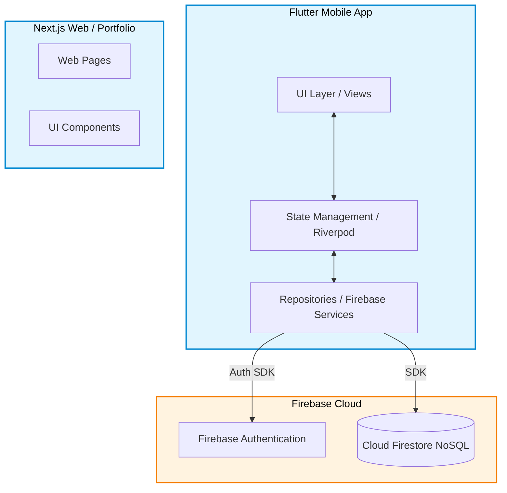
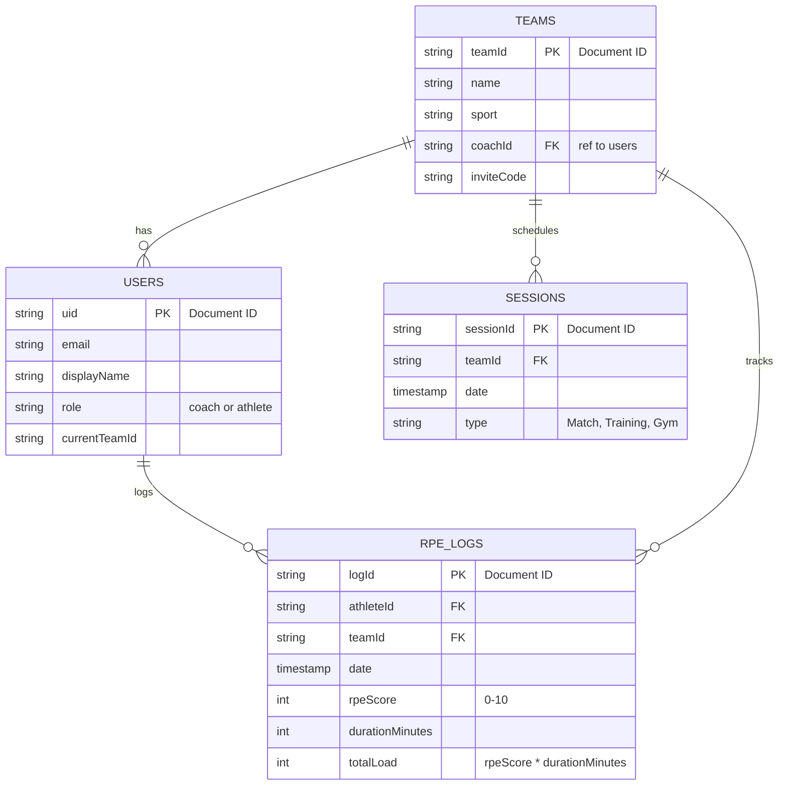

  
  <h1>RPE App Showcase</h1>
  
<strong>A frictionless load management & sports science platform for teams.</strong>

> **Note:** This is a showcase repository. The source code for the RPE App is proprietary and closed source. This repository provides a high-level overview of the architecture, technologies, and technical challenges solved during development.

## 💡 The RPE App Vision & Mechanics

### The Origin Story
The idea for the RPE app was born out of frustration. Unai Cerezo (a CAFYD student at UFV and football player) and Bruno Ramirez (studying Industrial Technologies Engineering and Engineering Physics at UC3M, and basketball player) constantly experienced the chaotic, broken methods of load management in non-elite sports. 

Teams were relying on clunky Google Forms, WhatsApp messages, or Excel spreadsheets to collect player data. Athletes would get tired of the friction, compliance would plummet, and coaches were left manually aggregating data instead of analyzing it—ultimately leading to a lack of actionable alerts when a player entered an injury "danger zone."

### The Magic of "sRPE"
The app revolves around the **Session RPE (sRPE) metric**, a scientifically backed load management calculation:
`sRPE = RPE (Rate of Perceived Exertion, 0-10) x Session Duration (minutes)`

### Frictionless UX
Our guiding principle was **Radical Simplicity**. We wanted to completely eliminate friction for the athlete while providing sports-science-grade analytics for the coach. An athlete's workflow to log a session takes **less than 10 seconds** using a visual slider, large touch targets, and haptic feedback.

---

## 📸 Sneak Peek

  
  &nbsp;&nbsp;
  
  &nbsp;&nbsp;
  

---

## 🛠 Tech Stack

The RPE App leverages a robust and scalable technology stack spanning mobile and web ecosystems:

### Mobile Application
- **Framework:** Flutter
- **Language:** Dart
- **State Management:** Riverpod (`flutter_riverpod`) for responsive, scalable state orchestration.
- **Routing:** GoRouter (`go_router`) with strict role-based (Coach vs. Athlete) and auth-based guards.
- **Architecture:** Feature-First (Clean Architecture) for modularity and scalability.
- **Localization:** `AppLocalizations` (l10n) for day-one English and Spanish support.

### Web Dashboard / Portfolio
- **Link:** [therpeapp.com](https://therpeapp.com)
- **Framework:** Next.js (React)
- **Styling:** Tailwind CSS
- **Animations:** Framer Motion

### Backend & Cloud Services (Serverless)
- **Authentication:** Firebase Auth (Seamless 1-tap Google Sign-In)
- **Database:** Cloud Firestore (with Offline Persistence explicitly enabled)

---

## 🏗 High-Level System Architecture

The mobile application strictly separates business logic from the UI using Riverpod, keeping the widget tree clean and performant.

---

## 🗄️ Database Schema (Firestore NoSQL)

We use a flat NoSQL structure in Cloud Firestore, optimized for quick reads and offline synchronization.

---

## 🚀 Technical Challenges Solved

### 1. Frictionless UX: Eliminating the "Burden" of RPE Logging
**Challenge:** The number one reason load management systems fail in non-elite sports is player burnout. If an athlete perceives data logging as a "burden" or chore, compliance drops drastically after a few weeks.
**Solution:** We engineered the UI around the "10-Second Rule". We bypassed cumbersome text inputs and dropdowns in favor of fluid visual sliders, large interactive touch targets, and satisfying haptic feedback. The entire workflow—from receiving the post-session push notification to submitting the data—is streamlined to feel rewarding rather than taxing. 

### 2. High-Performance "Glassy" UI with Zero Hardcoding
**Challenge:** Implementing premium glassmorphic aesthetics (`BackdropFilter`, frosted navbars, and slight borders) often leads to frame drops and layout thrashing if not handled correctly.
**Solution:** We strictly adhered to a centralized Design System (`AppSpacing`, `AppColors`, `AppTypography`). Absolutely zero UI properties are hardcoded. By heavily utilizing Riverpod to decouple business logic from the view layer, we minimized unnecessary widget rebuilds. Complex glass UI components only rebuild when their precise state changes, ensuring a locked 60fps experience.

### 3. Sports Science on the Edge (Offline Persistence)
**Challenge:** Training facilities and pitches frequently have poor cellular reception. A load management app is useless if an athlete can't submit their RPE immediately after the session. Additionally, running complex ACWR (Acute:Chronic Workload Ratio) aggregations in the cloud is expensive.
**Solution:** We architected the app with Cloud Firestore's **Offline Persistence** enabled by default. Athletes can seamlessly log sessions without a connection; the app automatically syncs when they regain reception. Furthermore, to keep cloud costs low and speed high, complex metrics (ACWR, Monotony, Strain) are initially calculated directly on the device using efficient Riverpod selectors.

---

  <i>Built with passion by Unai Cerezo & Bruno Ramirez</i>

