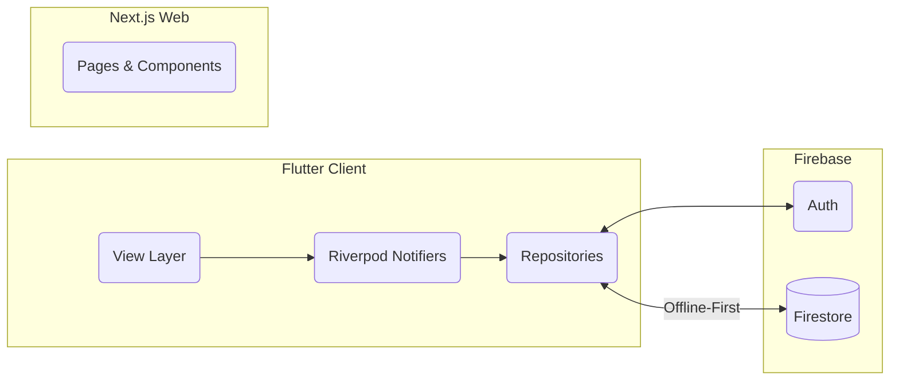
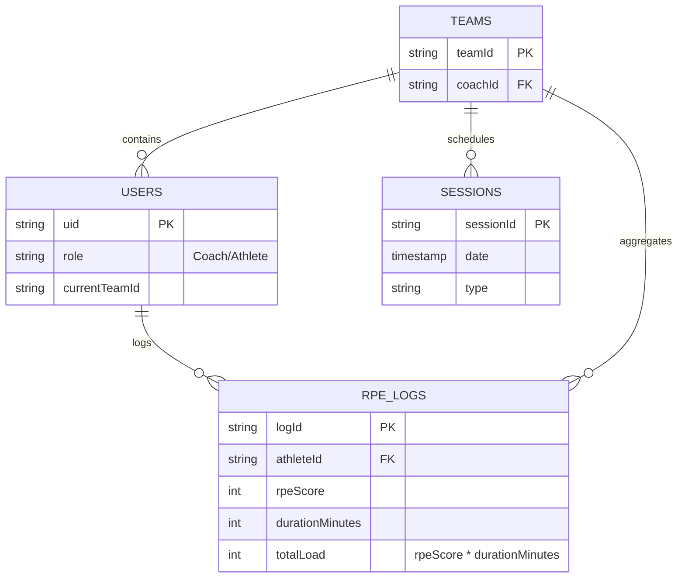

  

# RPE: The Athlete-First Load Management Platform

> *Note: This is a public showcase repository. The source code is proprietary. The documentation below highlights the system architecture, design philosophy, and technical implementation.*

## ⚡ The Philosophy: Zero-Friction Compliance

In non-elite sports, the biggest hurdle to load management isn't the math—it's **player burnout**. When athletes are forced to use chaotic Google Forms or clunky spreadsheets, compliance inevitably drops. 

**RPE was built to solve this.** Conceived by Unai Cerezo (CAFYD) and Bruno Ramirez (Engineering/Physics) out of their own frustrations in football and basketball, RPE operates on a single core principle: **The 10-Second Rule**. By replacing text inputs with haptic-enabled sliders and large touch targets, athletes can log their Session RPE (`RPE x Duration`) instantly, giving coaches the data they need to prevent injuries without the overhead.

---

## 📱 Platform Showcase

| The Landing Experience | Athlete Workspace | Coach & Team Analytics |
| :---: | :---: | :---: |
|  |  |  |
| *Clean, compelling entry point for users.* | *Frictionless data entry and wellness tracking.* | *Actionable insights and load distribution.* |

---

## 🛠️ Architecture & Engineering

### The Stack
The RPE platform is a unified ecosystem seamlessly connecting mobile clients to a robust web presence.

- **Mobile App:** Built with **Flutter** & **Dart**. State management is handled entirely by **Riverpod**, enforcing a strict separation of concerns (Clean Architecture).
- **Web Portfolio:** [therpeapp.com](https://therpeapp.com) is powered by **Next.js**, **React 19**, and **Tailwind CSS**, featuring liquid animations via **Framer Motion**.
- **Cloud Infrastructure:** **Firebase** provides Serverless Auth (Google Sign-In) and a NoSQL Database (Cloud Firestore).

### Engineering Highlight: "Sports Science on the Edge"
Because training facilities often lack cellular reception, a cloud-dependent app is a point of failure. RPE is engineered for the edge:
1. **Offline Persistence:** Firestore is heavily optimized to cache writes locally. Athletes can log data deep inside a locker room, and the app seamlessly syncs when the connection is restored.
2. **On-Device Computation:** To minimize cloud costs and reduce latency, complex load management algorithms (like Acute:Chronic Workload Ratios) are initially computed on the device using Riverpod selectors.

---

## 🧠 System Topologies

### Client-Cloud Topology
The application strictly isolates the UI from business logic to maintain 60 FPS performance, even with heavy glassmorphic rendering (`BackdropFilter`).

### Relational Data Model (NoSQL)
RPE utilizes a highly flattened NoSQL structure to ensure blazing fast reads and simple offline synchronization.

---

*Designed and engineered by Unai Cerezo & Bruno Ramirez.*
