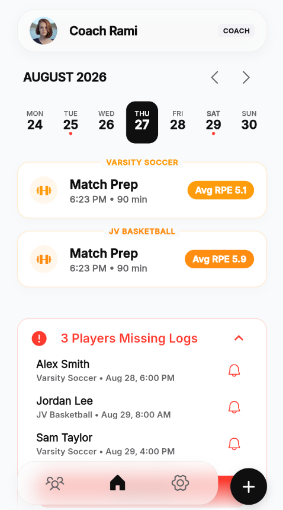
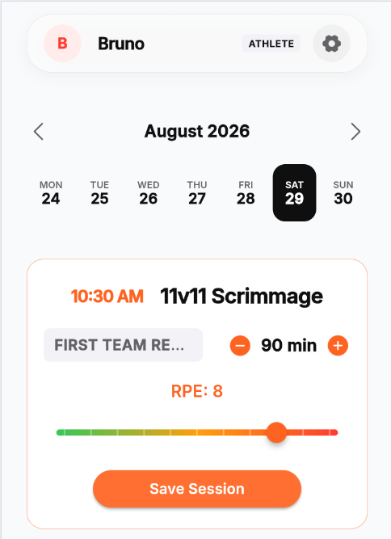
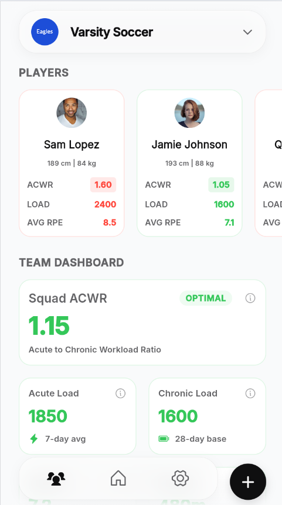
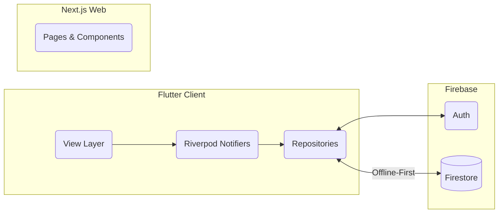
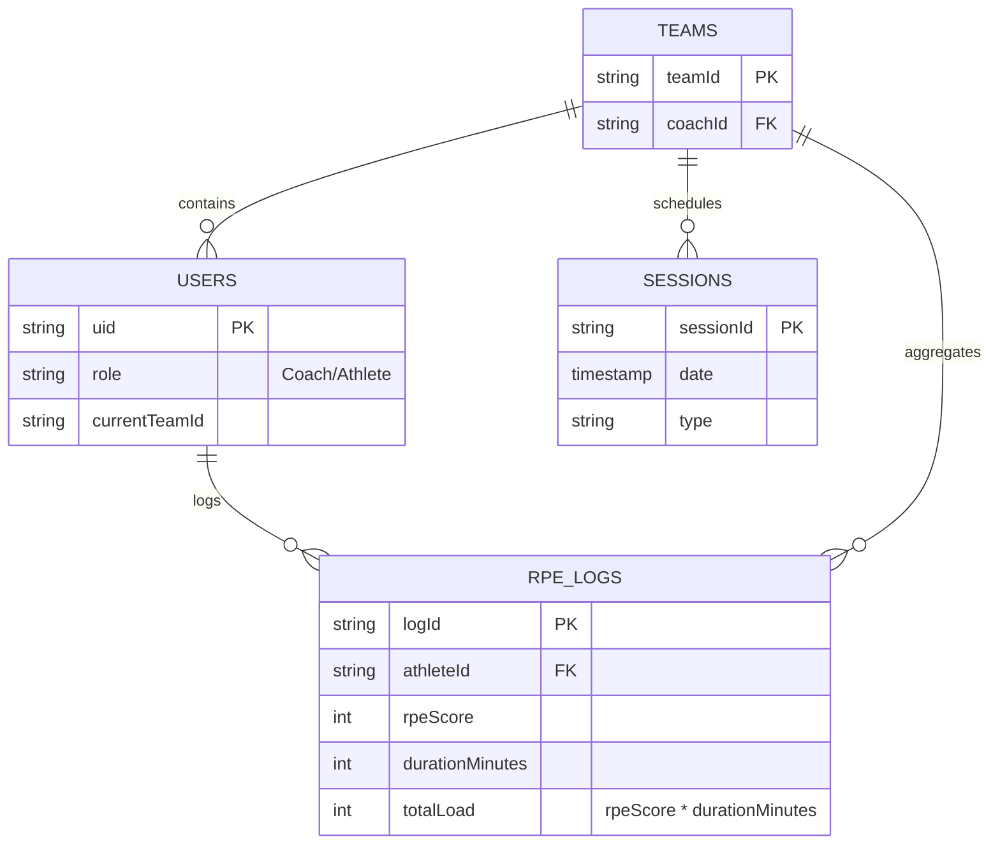

  

# RPE: The Athlete-First Load Management Platform

> *Note: This is a public showcase repository. The source code is proprietary. The documentation below highlights the system architecture, design philosophy, and technical implementation.*

## ⚡ The Philosophy: Zero-Friction Compliance

In non-elite sports, the biggest hurdle to load management isn't the math—it's **player burnout**. When athletes are forced to use chaotic Google Forms or clunky spreadsheets, compliance inevitably drops. 

**RPE was built to solve this.** Conceived by Unai Cerezo (CAFYD) and Bruno Ramirez (Engineering/Physics) out of their own frustrations in football and basketball, RPE operates on a single core principle: **The 10-Second Rule**. By replacing text inputs with haptic-enabled sliders and large touch targets, athletes can log their Session RPE (`RPE x Duration`) instantly, giving coaches the data they need to prevent injuries without the overhead.

---

## 📱 Platform Showcase

| The Landing Experience | Athlete Workspace | Coach & Team Analytics |
| :---: | :---: | :---: |
|  |  |  |
| *Clean, compelling entry point for users.* | *Frictionless data entry and wellness tracking.* | *Actionable insights and load distribution.* |

---

## 🛠️ Architecture & Engineering

### The Stack
The RPE platform is a unified ecosystem seamlessly connecting mobile clients to a robust web presence.

- **Mobile App:** Built with **Flutter** & **Dart**. State management is handled entirely by **Riverpod**, enforcing a strict separation of concerns (Clean Architecture).
- **Web Portfolio:** [therpeapp.com](https://therpeapp.com) is powered by **Next.js**, **React 19**, and **Tailwind CSS**, featuring liquid animations via **Framer Motion**.
- **Cloud Infrastructure:** **Firebase** provides Serverless Auth (Google Sign-In) and a NoSQL Database (Cloud Firestore).

### Engineering Highlight: "Sports Science on the Edge"
Because training facilities often lack cellular reception, a cloud-dependent app is a point of failure. RPE is engineered for the edge:
1. **Offline Persistence:** Firestore is heavily optimized to cache writes locally. Athletes can log data deep inside a locker room, and the app seamlessly syncs when the connection is restored.
2. **On-Device Computation:** To minimize cloud costs and reduce latency, complex load management algorithms (like Acute:Chronic Workload Ratios) are initially computed on the device using Riverpod selectors.

---

## 🧠 System Topologies

### Client-Cloud Topology

The architecture relies on a highly decoupled **Feature-First (Clean Architecture)** structure to ensure the mobile client remains lightweight, testable, and capable of maintaining a locked 60 FPS—even when rendering computationally expensive UI elements like glassmorphic `BackdropFilters`.

*   **View Layer (UI):** Built entirely with stateless or simplistic stateful widgets. Absolutely zero hardcoding is permitted; all UI components inherit from a centralized, localized Design System (`AppTheme`, `AppSpacing`, `AppColors`).
*   **State Management (Riverpod):** The true engine of the app. Business logic, Firebase streams, and caching mechanisms are wrapped in reactive `Providers` and `Notifiers`. The UI simply watches (`ref.watch`) these granular state nodes, guaranteeing that only the specific widgets whose data has changed are rebuilt.
*   **Routing & Guards (GoRouter):** Navigation is state-driven. Strict route guards intercept navigation events based on Riverpod authentication states, automatically redirecting users to the appropriate role-based dashboards (Coach vs. Athlete) without UI flickering.
*   **Web Dashboard (Next.js):** The web presence (`therpeapp.com`) acts as the marketing and portfolio gateway, utilizing React 19 and Tailwind CSS. It leverages Framer Motion to deliver premium, hardware-accelerated fluid animations that mirror the mobile app's "glassy" aesthetic.

### Data Model & Backend Infrastructure

Instead of relying on a traditional relational database, RPE is built on a **Serverless Firebase Infrastructure** utilizing Cloud Firestore. This decision was driven by the strict requirement for **Offline Persistence** in unpredictable sports environments (e.g., poor reception on pitches or in locker rooms).

*   **Offline-First Synchronization:** The repository layer is configured to cache all Firestore reads and queue all writes locally by default. When an athlete submits an RPE log without a cellular connection, the app immediately resolves the state optimistically and syncs the payload to the cloud the moment connectivity is restored.
*   **Flattened NoSQL Schema:** To optimize read speeds and reduce document size, the database avoids deep nesting. High-volume data (like `RPE_LOGS`) is kept in root-level collections and linked to `USERS` and `TEAMS` via foreign keys (`uid`, `teamId`). This allows coaches to query thousands of session logs across a roster without pulling unnecessary user metadata.
*   **On-Device Aggregation:** Rather than relying on expensive Cloud Functions for every metric, initial sports science calculations (Acute Load, Chronic Load, ACWR) are processed directly on the edge using efficient Riverpod selectors parsing the locally cached `RPE_LOGS`.

---

*Designed and engineered by Unai Cerezo & Bruno Ramirez.*
